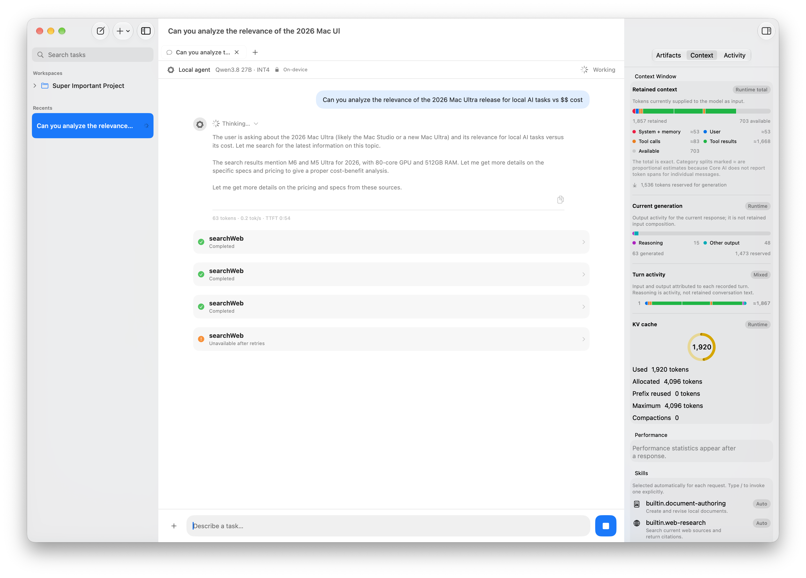
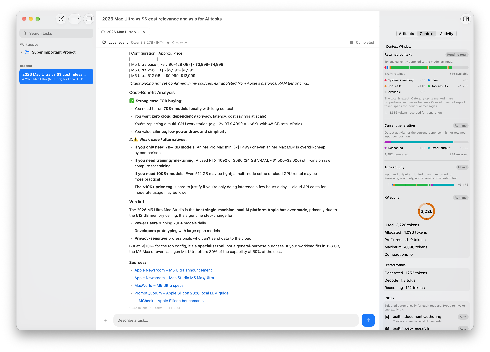

# CoreAI Agent

CoreAI Agent is a vibe-coded exploration of Apple’s Core AI and Swift APIs. It bundles local Deep and Fast models inside a native macOS app and explores what basic, private agentic workflows can feel like when inference, conversations, tools, and runtime telemetry all live on the Mac.



> Reasoning, tool activity, retained-context composition, and KV-cache usage remain visible while the agent works.

The app includes persistent conversations and workspaces, streamed reasoning and Markdown responses, automatic skill discovery, approval-gated web search, document artifacts, context compaction, and performance statistics.



## Requirements

- Apple Silicon Mac with substantial unified memory
- macOS 27 and Xcode 27 or newer
- Git LFS
- [UV](https://docs.astral.sh/uv/) for installing the Hugging Face CLI
- About 50 GB of free disk space for the model checkout and packaged app

Deep mode uses an approximately 19 GB Qwen3.8 27B INT4 model. Fast mode uses NVIDIA Nemotron 3 Nano 4B with a native 4.6 GB Core AI INT8 conversion; reasoning is off by default and can be enabled from the mode menu. A smaller Qwen3 0.6B INT4 model generates conversation titles. Model choice is saved per conversation and can be changed mid-session; the next turn re-prefills the visible conversation with the selected model.

## Build and run

Clone the repository, fetch the small title model through Git LFS, and download the pinned Deep and Fast Core AI artifacts from Hugging Face:

```sh
git clone <repository-url>
cd coreai-agent
git lfs install
git lfs pull
uv tool install huggingface-hub
make download
```

`make download` uses the `hf` command installed by `huggingface-hub` to fetch the pinned model revision.

Verify the toolchain, run the tests, and package the app:

```sh
make preflight
make test
make package
open "dist/CoreAI Agent.app"
```

The inference models are hosted outside GitHub because their compiled payloads exceed this repository's Git LFS per-object limit. `make package` performs a release build and embeds the Deep, Fast, and title models in the application bundle. Once packaged, the app performs no model download; Fast/Deep selection only chooses between bundled Core AI resources.

The Nemotron conversion is published at [`ETeissonniere/Nemotron-3-Nano-4B-CoreAI`](https://huggingface.co/ETeissonniere/Nemotron-3-Nano-4B-CoreAI) under the NVIDIA Nemotron Open Model License. See [the redistribution and provenance notes](docs/Nemotron-Model-Redistribution.md) before distributing a build.

See [COREAI.md](COREAI.md) for model provenance, reproducible export commands, and details about the local Core AI runtime adaptation.

## Experimental status

This is an exploration, not a production assistant. It targets beta Apple APIs and tooling; the pinned 27B artifact currently has a 4,096-token context window; web search requires approval before a query leaves the Mac; and the generated app is intended for local development rather than distribution—it is ad hoc signed for local use, not Developer ID signed or notarized.

CoreAI Agent is an independent project and is not affiliated with, endorsed by, or sponsored by Apple Inc. Apple is a trademark of Apple Inc.; references to Core AI describe the Apple technologies explored by this project.
